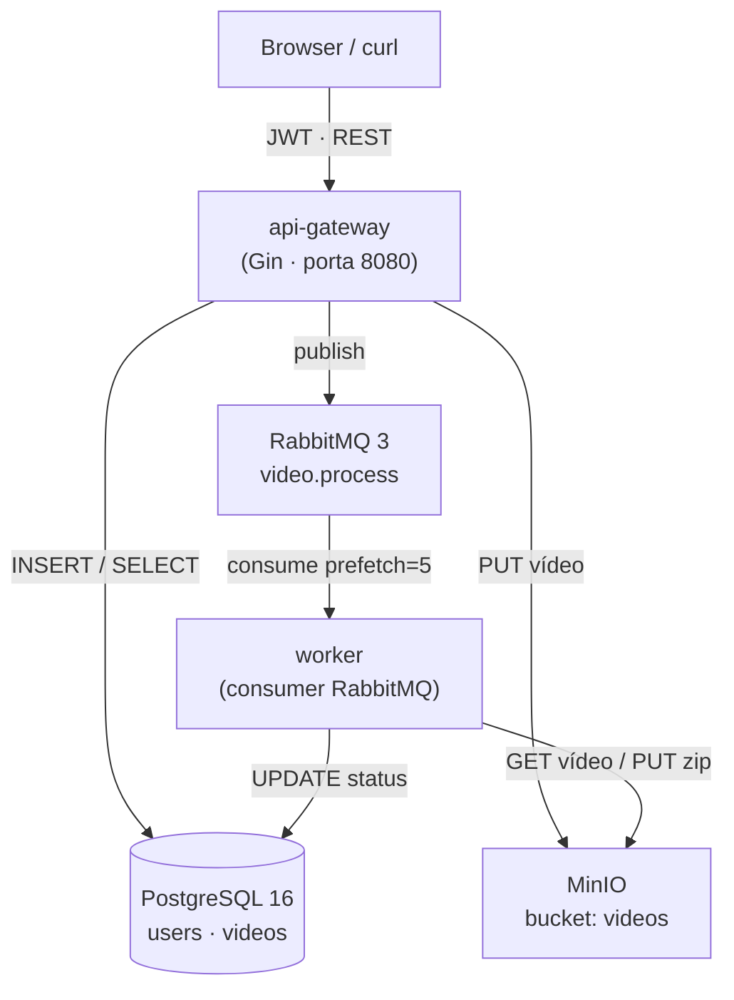
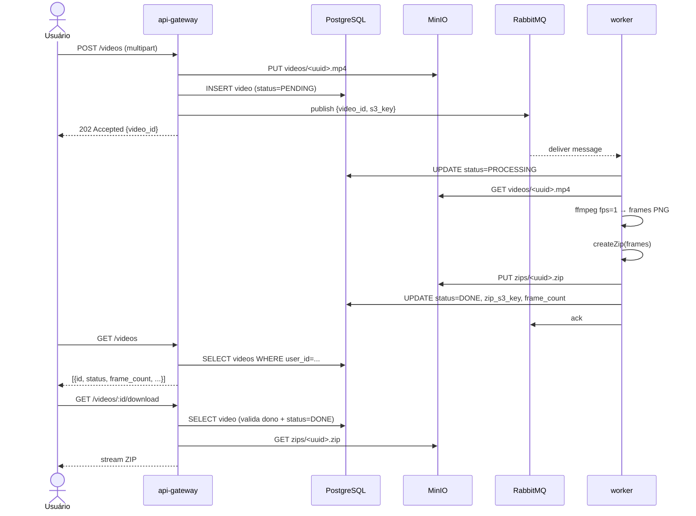

# Arquitetura — FIAP X

## Visão geral de componentes



## Diagrama de sequência — Upload e processamento



## Decisões técnicas

### Hexagonal / Ports & Adapters

Cada serviço expõe interfaces de domínio (ports) em `domain/`. As implementações
concretas (adapters) ficam em subpacotes (`repository/`, `storage/`, `queue/`).
Isso permite substituir qualquer dependência sem alterar a lógica de negócio e
testar com mocks sem I/O real.

```
domain.UserRepository  ←  repository.UserRepo   (pgx)
domain.ObjectStorage   ←  storage.MinIOStorage  (minio-go)
domain.QueuePublisher  ←  queue.RabbitMQPublisher
pipeline.VideoProcessor ← processor.Processor   (ffmpeg)
```

### Resiliência da fila

A fila `video.process` é **durável** com mensagens **persistentes**. O worker
usa `prefetch=5` e **ack manual**: a mensagem só é removida da fila após
`UpdateDone` concluir com sucesso. Em caso de falha o ack não é enviado e
o broker reenfileira para outro worker.

### Escalabilidade horizontal

O worker não tem estado local — qualquer número de réplicas pode consumir a
mesma fila em paralelo. Em Kubernetes, o HPA escala de 2 a 20 réplicas com
base em CPU. Para escalar por profundidade da fila, substituir o HPA pelo
`ScaledObject` do KEDA (ver comentário em `k8s/worker.yaml`).

### Autenticação

JWT HS256, segredo via variável de ambiente `JWT_SECRET` (mínimo 32 chars).
Tokens expiram em `JWT_EXPIRATION_HOURS` (padrão 24 h). O middleware extrai
o `userID` do claim e injeta no contexto Gin — nenhum handler precisa validar
token diretamente.

### Notificação de erros

Interface `Notifier` com implementação `LogNotifier` (log estruturado). A
interface permite trocar por SMTP ou Slack sem alterar o pipeline do worker.

## Estrutura de pastas

```
fiapx/
├── api-gateway/
│   ├── cmd/api/main.go       # wiring: env → repos → services → handlers → Gin
│   ├── config/               # leitura de variáveis de ambiente
│   ├── domain/               # structs + interfaces (User, Video, ports)
│   ├── handler/              # auth, video, health
│   ├── middleware/           # JWTAuth
│   ├── mocks/                # mocks manuais das interfaces de domínio
│   ├── queue/                # RabbitMQPublisher
│   ├── repository/           # UserRepo + VideoRepo (pgx)
│   ├── service/              # AuthService, VideoService
│   ├── storage/              # MinIOStorage
│   ├── web/                  # index.html (//go:embed)
│   └── go.mod
├── worker/
│   ├── cmd/worker/main.go    # wiring
│   ├── config/
│   ├── consumer/             # thin AMQP adapter (RabbitMQ, prefetch, ack)
│   ├── domain/               # interfaces de domínio do worker
│   ├── mocks/
│   ├── notification/         # LogNotifier
│   ├── pipeline/             # lógica testável de processamento
│   ├── processor/            # ffmpeg fps=1 + createZip
│   ├── repository/           # UpdateStatus, UpdateDone (pgx)
│   ├── storage/              # MinIOStorage (download vídeo, upload zip)
│   └── go.mod
├── k8s/                      # manifestos Kubernetes (Kustomize)
│   ├── namespace.yaml
│   ├── configmap.yaml
│   ├── secrets.yaml.example  # template — copiar para secrets.yaml (gitignored)
│   ├── postgres.yaml
│   ├── rabbitmq.yaml
│   ├── minio.yaml
│   ├── api-gateway.yaml
│   ├── worker.yaml
│   └── kustomization.yaml
├── terraform/                # infraestrutura AWS EKS
│   ├── main.tf               # VPC, subnets, NAT GW, EKS cluster, node group
│   ├── variables.tf
│   └── outputs.tf
├── legacy/                   # monolito original (referência)
├── scripts/
│   ├── init.sql              # criação de tabelas (montado no postgres)
│   └── coverage.sh           # gate de cobertura ≥ 80%
├── .github/workflows/ci.yml  # lint → test → sonar → docker
├── docker-compose.yml
├── sonar-project.properties
└── .env.example
```
